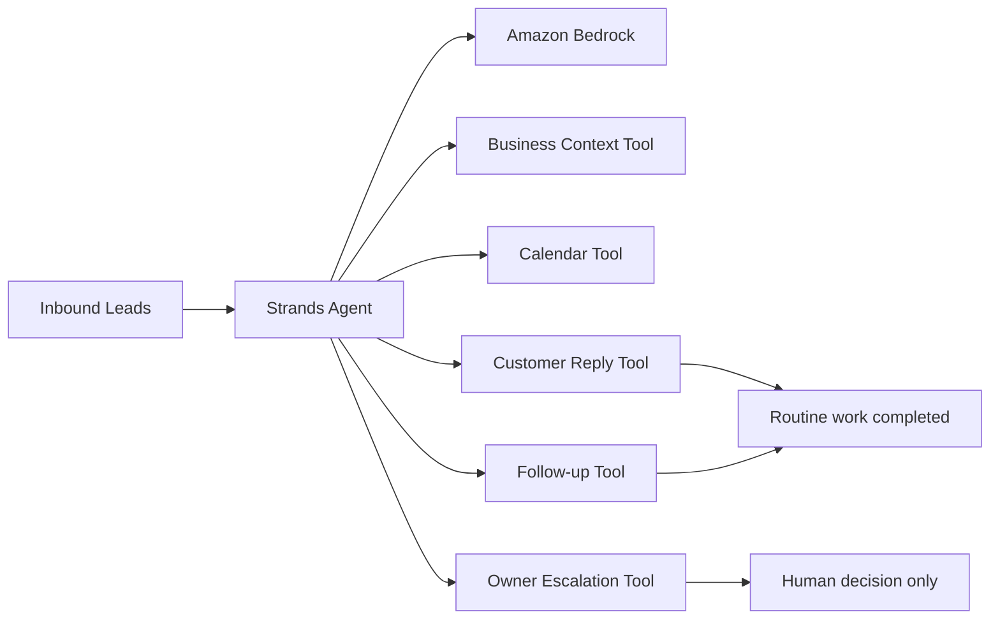

# Lead Rescue

**An autonomous lead-follow-up agent for busy small-business owners, built with the Strands Agents SDK and Amazon Bedrock.**

Lead Rescue handles the repetitive work between a new inquiry and a real owner decision. It loads business policy, reads the inbound lead queue, checks actual appointment availability, sends routine replies, schedules follow-ups, and pauses only when a human decision is genuinely required.

Built during the **Agents for Humans Hackathon 2026** for the **Professional Agents** track.

## Why it exists

Small service businesses lose leads because the owner is simultaneously doing the work, driving, quoting jobs, answering calls, and managing a calendar. Most lead software creates another inbox. Lead Rescue is designed to quietly clear routine work and surface only decisions that need the owner.

## What the demo proves

The included sample queue intentionally contains three different cases:

1. **Urgent no-cooling request** — the agent checks real availability and can offer a valid same-day slot.
2. **Price-match negotiation** — the agent is prohibited from inventing a discount, so it escalates a concise decision to the owner.
3. **Routine tune-up** — the agent uses published business information, checks availability, replies, and schedules follow-up.

This is an action-taking agent, not a chatbot. Its tools update workflow state.

## Architecture



## Tools

The single-file agent in `lead_rescue.py` implements:

- `get_business_context`
- `get_new_leads`
- `check_availability`
- `send_customer_reply`
- `schedule_follow_up`
- `escalate_to_owner`
- `mark_lead_closed`

## Run locally

Requirements: Python 3.10+ and AWS credentials with Amazon Bedrock model access.

```bash
python -m venv .venv
source .venv/bin/activate  # Windows: .venv\Scripts\activate
pip install -r requirements.txt
python lead_rescue.py
```

Strands uses Amazon Bedrock natively. The demo selects `global.anthropic.claude-sonnet-4-6` in `us-west-2`. Change the model ID or region if your AWS account uses different enabled Bedrock access.

AWS-supported credential methods include environment variables, `aws configure`, IAM roles, or a Bedrock API key. **Never commit credentials to this repository.**

## Human-in-the-loop safety

Lead Rescue is deliberately conservative around irreversible or owner-only decisions. The system prompt and tool boundary prohibit autonomous discounts, price matching, unsupported promises, unusual warranty commitments, and legal commitments. Those cases become explicit owner decisions with concise options.

## Commercial path

The same architecture can be adapted to HVAC companies, roofers, electricians, garage-door companies, landscapers, junk-removal companies, and other local businesses where slow response and forgotten follow-up directly cost revenue.

The product is not “AI chat.” The outcome is **faster lead response, fewer forgotten leads, and fewer unnecessary owner interruptions.**

## Hackathon disclosure

This project was newly created during the 2026 Agents for Humans Hackathon submission period. AI coding assistance was used during development. No pre-existing application code was incorporated.

## License

MIT
