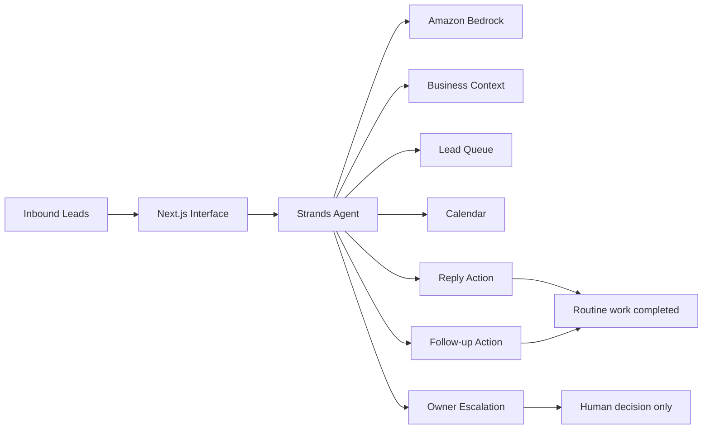

# Lead Rescue

**An autonomous lead-follow-up agent for busy small-business owners, built with the Strands Agents SDK.**

Lead Rescue takes on the repetitive work between “new inquiry” and “owner decision.” It reads inbound leads, loads business policy, checks real appointment availability, sends routine customer replies, schedules follow-ups, and pauses only when a human decision is actually required.

Built during the **Agents for Humans Hackathon 2026** for the **Professional Agents** track.

## The problem

Small service businesses lose good leads because the owner is simultaneously doing the work, answering calls, driving, quoting jobs, and managing a calendar. Typical lead software creates another inbox to manage. Lead Rescue is designed to do the opposite: quietly clear routine work and surface only decisions that genuinely need the owner.

## What the demo proves

The sample queue contains three intentionally different leads:

1. **Urgent no-cooling request** — the agent identifies urgency, checks actual availability, and can offer a valid same-day slot.
2. **Price-match negotiation** — the agent is not allowed to invent a discount, so it escalates a concise decision to the owner.
3. **Routine tune-up** — the agent checks calendar availability, responds using published business information, and schedules follow-up.

This is not a chatbot demo. The agent has tools that change lead state and create real workflow actions.

## Architecture



A larger version is in [`docs/architecture.md`](docs/architecture.md).

## Strands implementation

The core agent lives in [`lib/agent.ts`](lib/agent.ts). It uses the Strands tool system for:

- `get_business_context`
- `get_new_leads`
- `check_availability`
- `send_customer_reply`
- `schedule_follow_up`
- `escalate_to_owner`
- `mark_lead_closed`

The preferred hackathon model path is **Amazon Bedrock**. A Vercel AI Gateway model path is included as a convenience for a live hosted demo when Bedrock credentials are not present.

## Run locally

Requirements: Node.js 20+ and an AWS account with Bedrock model access.

```bash
npm install
cp .env.example .env.local
# configure AWS credentials using your preferred AWS-supported method
npm run dev
```

Open `http://localhost:3000` and press **Run the lead queue**.

### Amazon Bedrock configuration

The app automatically uses Bedrock when AWS credentials are present. The default model ID is:

```text
global.anthropic.claude-sonnet-4-6
```

Override it with `BEDROCK_MODEL_ID` if your AWS account uses a different enabled Bedrock model.

### Optional Vercel live-demo fallback

If AWS credentials are absent, the app uses the Vercel AI Gateway adapter supported by Strands. On a Vercel project with AI Gateway enabled, OIDC can provide authentication without storing a provider API key.

## Safety / human-in-the-loop design

Lead Rescue is intentionally conservative around irreversible or owner-only decisions. The prompt and tool boundary prohibit the agent from independently making discounts, price matches, unusual warranty commitments, or unsupported promises. Those cases are converted into explicit owner decisions with options.

## Why this can become a business

The same architecture can be adapted to garage-door companies, roofers, landscapers, HVAC contractors, electricians, junk-removal companies, and other local businesses where missed or slow lead response directly costs revenue.

The commercial product is not “AI chat.” The outcome is **faster lead response, fewer forgotten follow-ups, and fewer owner interruptions.**

## Hackathon disclosure

This project was newly created during the 2026 Agents for Humans Hackathon submission period. AI coding assistance was used during development. No pre-existing application code was incorporated.

## License

MIT
